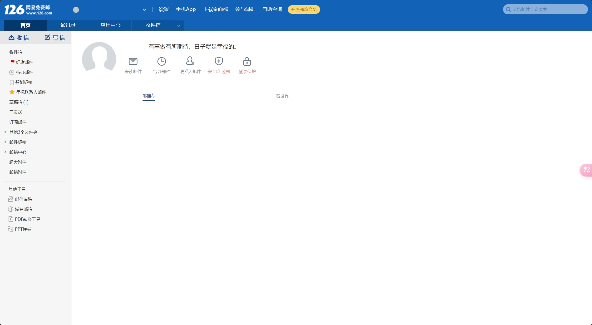

# CSS列表

## 目录

* [CSS列表](#css列表)
  * [目录](#目录)
  * [126邮箱深色模式](#126邮箱深色模式)
    * [功能](#功能)
    * [效果](#效果)
    * [安装链接](#安装链接)
    * [更新日志](#更新日志)

## [126邮箱深色模式](./126-mail-darkmode/126-mail-darkmode.css)

> 针对网易126邮箱(mail.126.com)的深色模式的样式表，使用`prefers-color-scheme`，跟随浏览器主题进行深色/浅色模式自动切换。

### 功能

* 为网易126邮箱添加深色模式样式，使用`prefers-color-scheme`，当浏览器切换为深色模式时，自动生效。

### 效果

| 设备 |                                          Before                                          |                                           After                                           |
|:--:|:----------------------------------------------------------------------------------------:|:-----------------------------------------------------------------------------------------:|
| 电脑 |                             |                             |
| 手机 |  |  |

### 安装链接

[126邮箱深色模式 - GreasyFork](https://greasyfork.org/zh-CN/scripts/487070-126邮箱深色模式)

### 更新日志

* 2024-02-11 Version 1.0-beta
  * 完成基本功能，仍在测试中~
