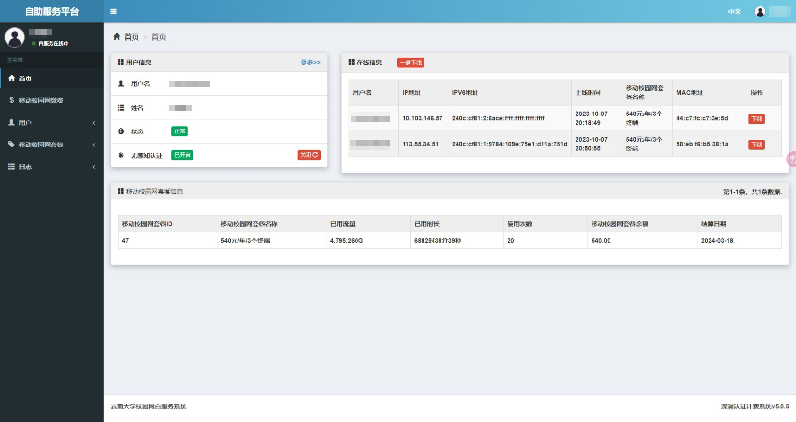
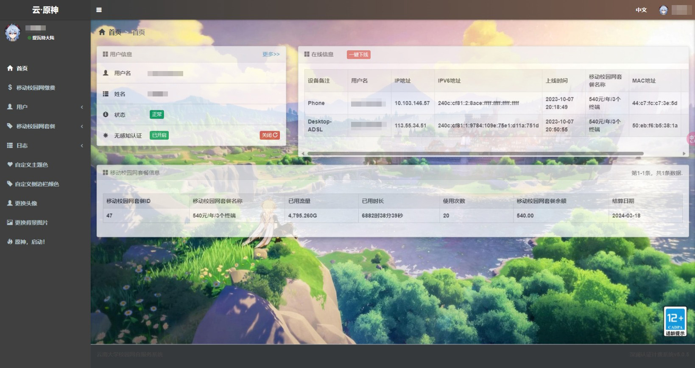
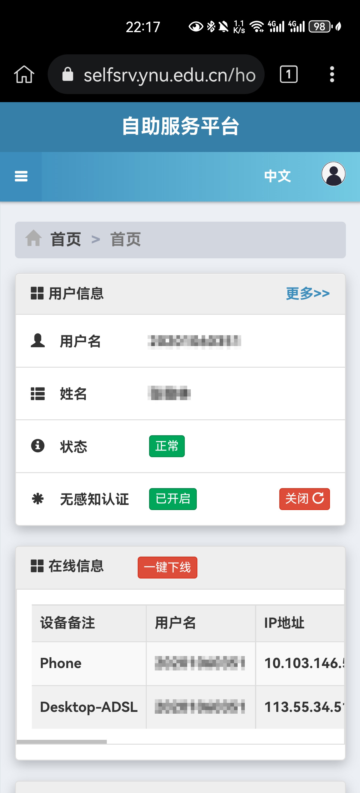
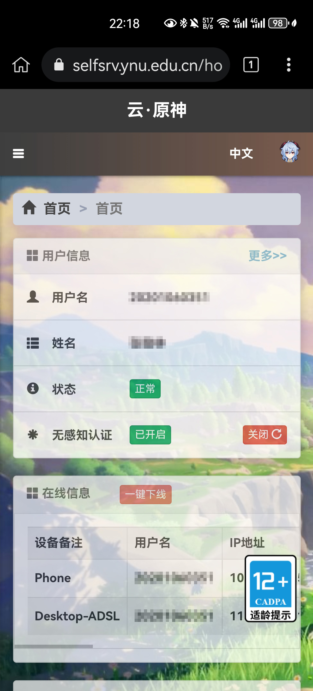

# 脚本列表

## 目录

* [脚本列表](#脚本列表)
  * [目录](#目录)
  * [云南大学校园网美化](#云南大学校园网美化)
    * [功能](#功能)
    * [效果](#效果)
    * [安装链接](#安装链接)
    * [更新日志](#更新日志)

## [云南大学校园网美化](./YNU-selfsrv-enhance.js)

> 对云南大学校园网([自助服务平台](https://selfsrv.ynu.edu.cn))进行界面美化的脚本，提高个性化定制程度。

### 功能

* [x] 在**首页/在线信息**和**日志/上网明细**中显示无感知认证的设备备注名
* [x] 自定义头像图片(支持图片直链或上传本地图片)
* [x] 自定义背景图(同上)
* [x] 自定义主题色
* [x] 自定义侧边栏颜色
* [x] 一键原神主题(原神，启动！)

### 效果

| 设备 |                                           Before                                           |                                              After                                               |
|:--:|:------------------------------------------------------------------------------------------:|:------------------------------------------------------------------------------------------------:|
| 电脑 |                            |                            |
| 手机 |  |  |

### 安装链接

[云南大学校园网美化 - GreasyFork](https://greasyfork.org/zh-CN/scripts/476284-云南大学校园网美化)

### 更新日志

* 2023-09-28 Version 1.0
  * 完成基本功能
* 2023-10-07 Version 1.1
  * 修复在移动端上无法显示背景图片的问题
  * 增添一键原神主题功能
  * 较大程度重构代码，规范格式
* 2023-10-09 Version 1.1.1
  * 修复了更换本地图片后不自动刷新的问题
* 2024-02-11 Version 1.1.2
  * 完善脚本的元信息
* 2024-04-04 Version 1.1.3
  * 修复了因原神官网资源变化导致的主题图片加载失败的问题
